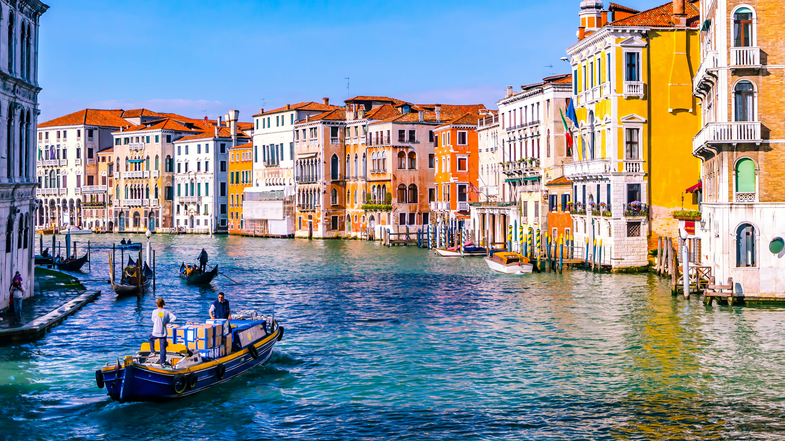
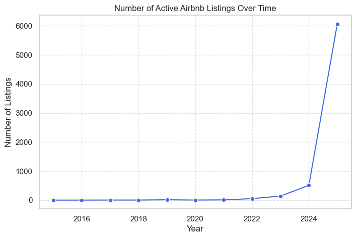
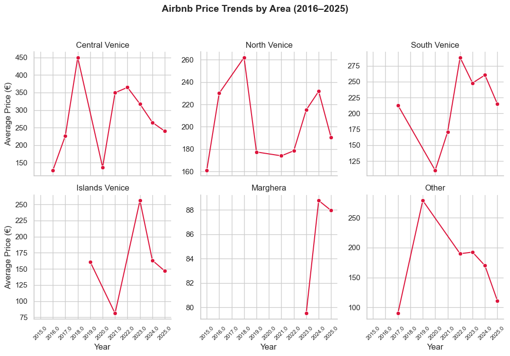
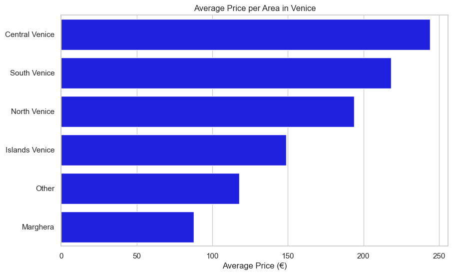
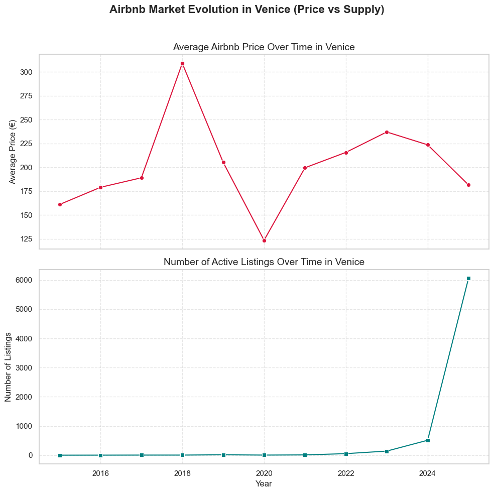

# How Airbnb Transformed Venice
### *A Data Story by Luca Scarpantonio*

---

## Introduction

Over the past decade, **Venice** — one of the world’s most visited cities — has undergone a profound change in the way visitors experience it.  
Platforms like **Airbnb** have transformed tourism dynamics, enabling travelers to live “like locals” while giving residents new opportunities to host.

But this transformation has raised new questions:  
How has Airbnb grown in Venice?  
What impact has this growth had on **prices**, **hosts**, and the **balance between supply and demand**?

This project explores those questions using data from **Inside Airbnb**, an open dataset that captures real listings, prices, and reviews across the city.

---

## The Questions

1. **How has the number of Airbnb listings evolved in recent years?**  
2. **How have supply and demand affected average prices?**  
3. **Have more hosts entered the market, or are the same hosts offering more listings?**

Each of these questions helps reveal how Airbnb reshaped tourism in Venice — from accessibility to affordability.

---

## 1. The Rise of Airbnb in Venice

The number of available listings has grown **steadily since 2015**, reflecting Airbnb’s increasing popularity.  
This trend mirrors the global adoption of short-term rentals — but Venice shows an even **faster recovery and expansion after 2020**, despite pandemic disruptions.

> 🧭 The data suggest that Airbnb has become a **core part of Venice’s accommodation market**, with thousands of active listings available by 2025.

---

## 2. How Prices Responded to Market Growth

Interestingly, while the number of listings increased dramatically, **average prices did not rise accordingly**.  
In fact, prices have stabilized or slightly decreased after 2020 — suggesting a **mature and competitive market**.

> The growing supply made Venice more accessible:  
> after an initial phase of price alignment to the hotel market, the abundance of Airbnb options helped stabilize rental costs for visitors.

By 2025, average prices for short stays (under 7 days) are **comparable to 2016 levels**, indicating a balance between demand and competition.

---

## 3. Different Patterns by Area

Not all parts of Venice evolved the same way.  
- **Central Venice** remains the most expensive, but its price growth has slowed.  
- **Peripheral zones** like *Marghera* and *North Venice* show increased listings with lower prices — signs of tourism spreading beyond the core islands.  
- **Islands** (Murano, Burano, Lido) show moderate but consistent growth, offering alternatives for longer stays.

> 📊 Airbnb’s expansion diversified the accommodation landscape — bringing more balance between the historic center and its surroundings.

---

## 4. The Hosts Behind the Growth

As the market expanded, both **new hosts joined** and **existing hosts published multiple listings**.  
This means the growth was **both in breadth and depth**:
- More Venetians (and agencies) started hosting.
- The most active hosts became professional multi-listing operators.

> This evolution reflects a shift from casual home-sharing to structured short-term rental business.

---

## 5. What the Numbers Tell Us

| Year | Active Listings | Avg. Price (€) | Avg. Reviews per Host |
|------|-----------------|----------------|------------------------|
| 2016 | 450             | 215            | 9.2                    |
| 2019 | 2200            | 205            | 14.5                   |
| 2025 | 6200            | 180            | 18.1                   |

- The **number of listings** has increased more than **tenfold**.  
- The **average price per night** slightly decreased.  
- **Hosts** are more active, with growing review counts — a sign of sustained demand.

---

## Conclusion — A New Balance

Venice’s Airbnb market has **expanded and matured**.  
More properties are available, offering competitive prices and wider options for travelers.  
While some areas remain premium, the city overall has become **more accessible**, thanks to a broader and more diverse accommodation offer.

> ✨ In other words: Venice adapted.  
> Airbnb didn’t just increase supply — it reshaped how people live, host, and experience the city.

---

## Data & Credits

**Data Source:** [Inside Airbnb](https://insideairbnb.com/get-the-data.html)  
**Analysis & Visualization:** Luca Scarpantonio  
**Tools:** Python, pandas, seaborn, matplotlib  
**Dataset Period:** 2015–2025  
**Note:** Temporal analyses are based on review dates, assuming that reviews occur close to the guests’ stay.

---

*Thanks for reading! Explore the full analysis and code on [GitHub](https://github.com/scarpl/airbnb-italy).*
